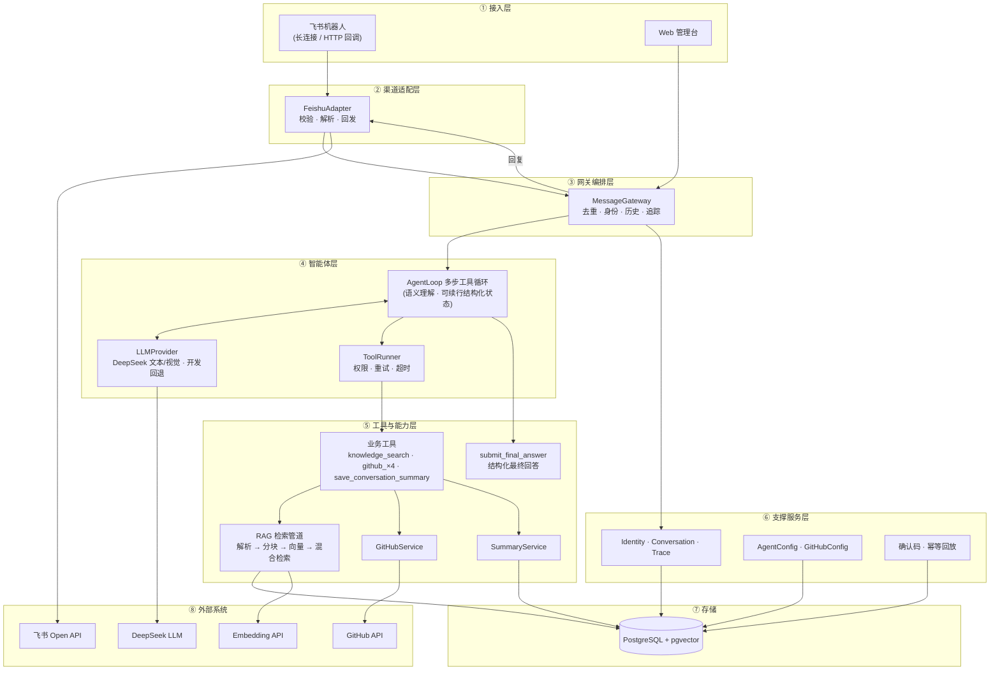
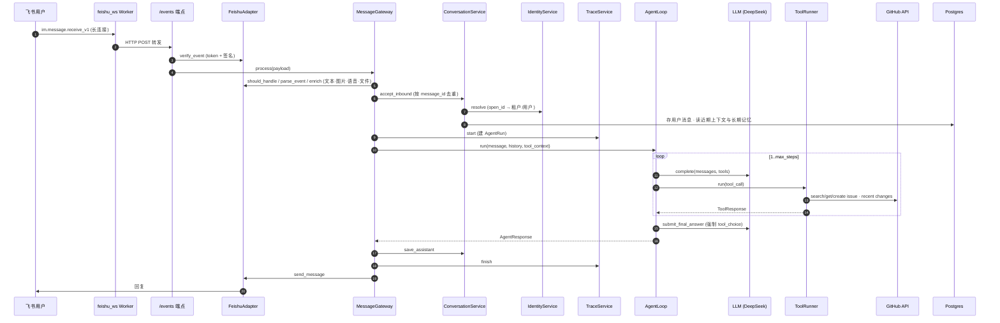

# FlowAgent 架构文档

> 视图方式：VSCode 装 `Markdown Preview Mermaid Support` 插件后 `Cmd/Ctrl + Shift + V` 预览；或整体贴到 https://mermaid.live 实时渲染/导出。

## 1. 逻辑架构图

## 2. 消息处理时序

## 3. 数据模型（16 张表，按域分组）

| 域 | 表 | 说明 |
|---|---|---|
| 运行配置 | `agent_configs`、`github_configs` | 单行全局配置（模型/系统提示词/步骤数/开关；GitHub token AES-GCM 加密） |
| 多租户 | `tenants`、`users`、`channel_accounts` | 租户 → 用户 → 渠道账号（open_id 绑定），首触自动建档 |
| 消息 | `conversations`、`messages`、`feedback` | 会话按 (租户,平台,外部会话ID) 唯一；消息按 external_message_id 去重 |
| 可观测 | `agent_runs`、`agent_steps` | 每次推理一条 run，每个 llm/tool 步一条 step |
| 安全/幂等 | `tool_operations`、`action_confirmations` | 写操作幂等回放；P0/P1 二次确认码（TTL） |
| 讨论沉淀 | `conversation_summaries` | 结构化总结：决策/缺陷/待办，可转真实 Issue |
| 知识库 | `knowledge_bases`、`knowledge_documents`、`document_chunks` | RAG：文档→分块→向量（pgvector/JSON） |

## 4. 关键事实

- **部署**：三容器 `docker-compose.yml` — `postgres(pgvector)`、`backend(uvicorn :8000)`、`web(nginx :80)`；backend 启动先 `alembic upgrade head`。
- **飞书双入口**：WebSocket 长连接 worker + HTTP 回调，汇聚到 `POST /api/v1/channels/feishu/events`。
- **Agent 编排**：`AgentLoop` 多步工具循环；最终回答强制走 `submit_final_answer`（强制 tool_choice + 关闭 thinking），由规章约束纯文本格式并保留真实 URL；终态区分 resolved/partial/blocked。
- **多模态**：飞书资源 API 下载图片、语音和文件；图片进入 DeepSeek 视觉模型，语音由本地 Whisper 转写，md/txt/文本 PDF 提取后进入上下文。
- **记忆**：最近 10 轮原文之外，注入已保存摘要/决策/待办，以及历史 Issue、URL 和重要约束。
- **7 个工具**：`knowledge_search`、`github_search_issue`、`github_get_issue`、`github_recent_changes`、`github_create_issue`（P0/P1 确认 + 幂等回放）、`save_conversation_summary`、`submit_final_answer`。
- **RAG**：解析(md/txt/pdf) → 重叠分块 → embedding（OpenAI 兼容 / 开发哈希回退）→ 混合检索（0.65 稠密余弦 + 0.35 BM25）→ `[citation_id]` 引用。
- **前端**：React 19 + Vite + react-router，8 页面，token 存 sessionStorage，SSE 实时 Trace 流。
